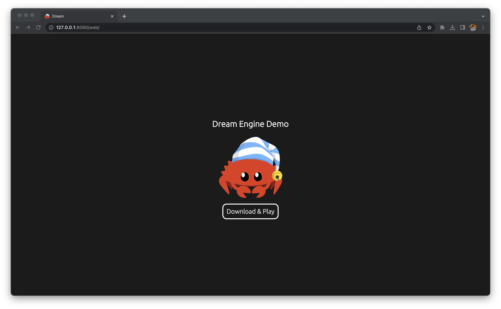

# Dream Engine [WIP]

 [](https://www.gnu.org/licenses/gpl-3.0)

<p align="center">
  <a href="https://github.com/rdeepak2002/dream-rs">
    
  </a>
</p>

## Author

[Deepak Ramalingam](https://github.com/rdeepak2002)

## About

🚧 Under construction - don't use yet! 🚧

Re-creation of [Dream Engine](https://github.com/rdeepak2002/dream) (real-time 3D engine) in Rust.

DREAM stands for D(eepak's game engine is) REA(lly a) M(azing).

## Requirements

- [rust](https://www.rust-lang.org/tools/install) (Version 1.68.0)
- [wasm-pack](https://rustwasm.github.io/wasm-pack/installer/) (Version 0.10.3)

- wasm32-unknown-unknown target for Rust
  - Installation command:

```shell
rustup target add wasm32-unknown-unknown
```

## Get Started (Desktop)

```shell
cargo run
```

## Get Started (Web)

```shell
./tools/build-web.sh
```

Serve ``web/index.html`` from ``web`` folder

[//]: # (## Tests)

[//]: # ()

[//]: # (```shell)

[//]: # (cargo test --workspace)

[//]: # (```)

[//]: # (## Security Audit)

[//]: # ()

[//]: # (```shell)

[//]: # (cargo install cargo-audit)

[//]: # (cargo audit)

[//]: # (```)

## Troubleshooting

### ``error[E0554]: #![feature] may not be used on the stable release channel``

Recommended solution: ``cargo clean``

Other
solutions: [https://stackoverflow.com/questions/53136717/errore0554-feature-may-not-be-used-on-the-stable-release-channel-couldnt](https://stackoverflow.com/questions/53136717/errore0554-feature-may-not-be-used-on-the-stable-release-channel-couldnt)

## Screenshots

### MacOS Desktop Build


### Web Assembly (Browser) Build




