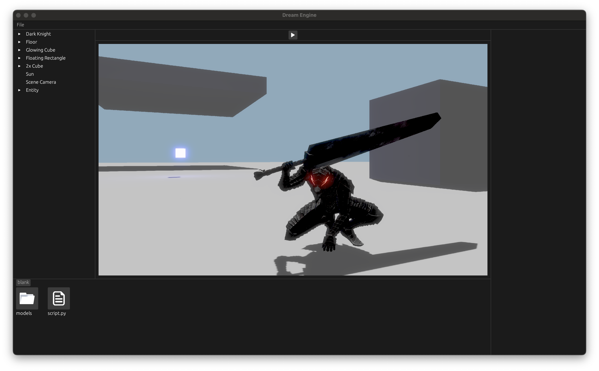

# Dream Engine [WIP]

 

  

## Author

[Deepak Ramalingam](https://github.com/rdeepak2002)

## About

🚧 Under construction - don't use yet! 🚧

Introducing Dream Engine: A groundbreaking real-time 3D engine that seamlessly integrates the capabilities of a
cutting-edge game engine with the collaborative prowess of Google Docs

<a href="https://staging.editor.dream-engine.app/"><strong>Check out the deployed site »</strong></a>
 

## Features

### Renderer

- [ ] Lights
  - [x] Directional lights
  - [x] Point lights
  - [ ] Spot lights
  - [ ] Area lights
- [ ] Shadows
  - [x] Cascaded shadow maps for directional lights
  - [ ] Point shadows
- [ ] Physically based rendering (PBR)
  - [x] Base color
  - [x] Normal map
  - [x] Metallic roughness
  - [x] Ambient occlusion
  - [x] Emissive
  - [x] PBR lighting
  - [ ] Image based lighting (IBL)
    - [ ] Diffuse irradiance
    - [ ] Specular IBL
- [ ] Atmospheric scattering
- [x] HDR environment maps
- [x] Normal mapping
- [ ] Parallax mapping
- [x] Deferred renderer for opaque meshes
- [x] Forward renderer for translucent meshes
- [x] Efficient mesh instancing
- [x] Physically based bloom
- [x] High dynamic range (HDR)
- [x] Gamma correction
- [x] Compute shader skinning
- [x] glTF asset support
- [ ] Screen space ambient occlusion (SSAO)
- [ ] Compute shader terrain rendering with slope texturing and tesselation
- [ ] Frustum culling
- [ ] Order-independent transparency (OIT)
- [ ] Global illumination (GI)
- [ ] Render graph

### Engine

- [x] Entity component system (abstraction of [shipyard](https://github.com/leudz/shipyard))
- [x] Python scripting system (powered by [RustPython](https://github.com/RustPython/RustPython))
- [ ] Physics system (powered by [Rapier](https://rapier.rs/))
- [ ] Audio system
- [ ] Animator system
- [x] Asset management with file handles and automatic resource deallocation
- [x] Cross-platform (web and desktop) file system library
- [x] Multithreaded task executor (powered by [rayon](https://github.com/rayon-rs/rayon))
  - [x] Support for web assembly build using web workers and shared
    memory ([SharedArrayBuffer](https://developer.mozilla.org/en-US/docs/Web/JavaScript/Reference/Global_Objects/SharedArrayBuffer))
  - [x] Multithreaded resource loading
- [x] Web assembly compilation support (powered by [wasm-pack](https://rustwasm.github.io/wasm-pack/))
- [ ] Terrain editor
- [ ] P2P editor collaboration
- [ ] Project exporter
- [x] Math library (abstraction of [nalgebra](https://nalgebra.org/))
- [ ] Editor user interface
  - [x] Renderer panel
  - [x] Inspector panel
  - [x] Asset panel
  - [ ] Debug console panel
  - [ ] Renderer gizmos

## Get Started

Please refer to the [user-facing docs](https://docs.dream-engine.app/guide/).

## Development

Please refer to the [development docs](https://docs.dream-engine.app/developer/).

## Contributing

This repository is closed to public contributions at the moment
